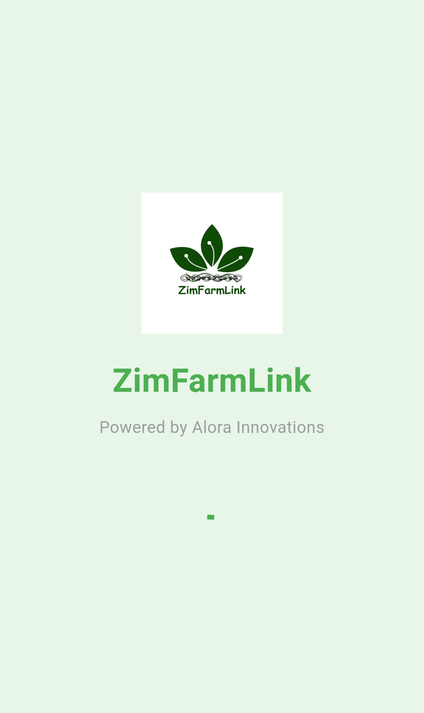
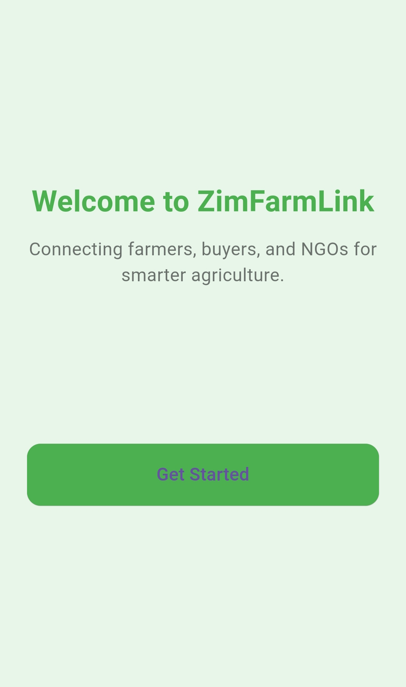
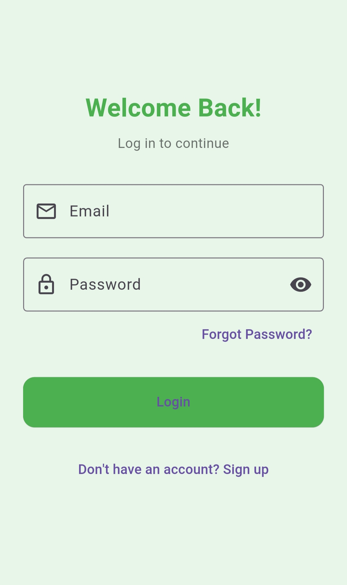
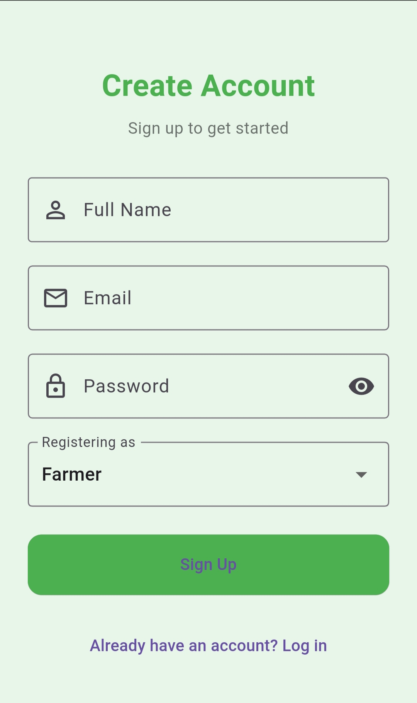
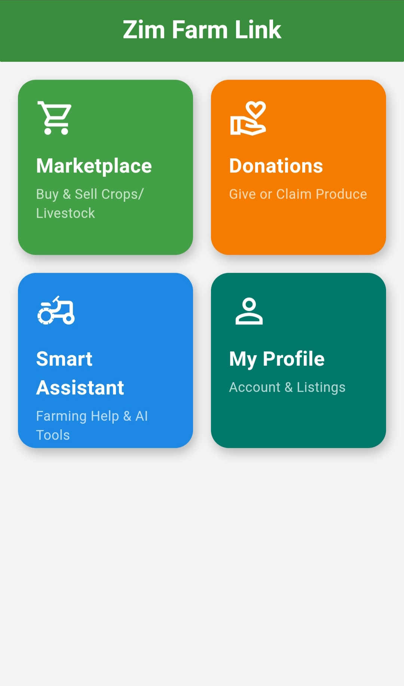
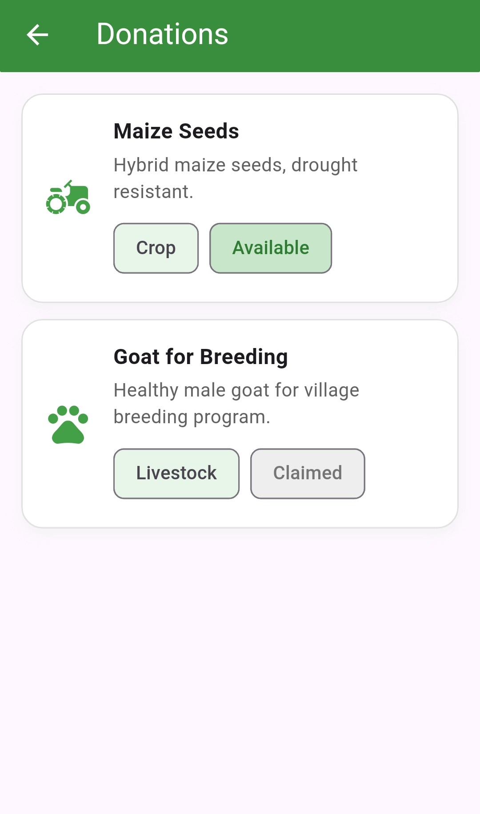
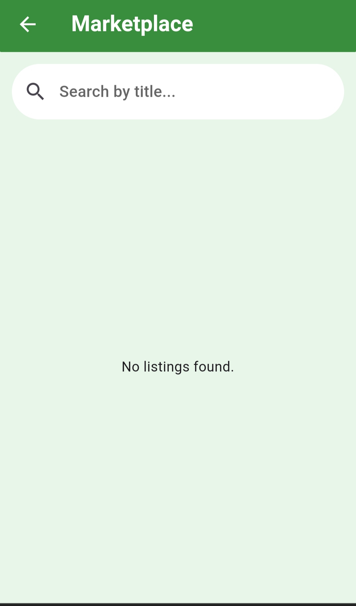
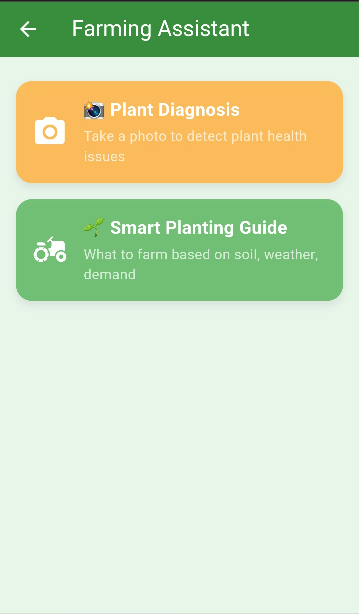

# 🌾 ZimFarmLink


> ⚠️ **Note:** This project is currently under active development. Some features may be incomplete or subject to change.

**ZimFarmLink** is a smart farming coordination platform designed to solve food shortages in Zimbabwe through modern digital agriculture. The app connects farmers, buyers, NGOs, and government to promote effective, region-based planting, donations, and marketplace access.

> **🌱 Powered by Alora Innovations**

---

## 🚀 MVP Features (Live Now)

- 🌽 **Marketplace**: Farmers list crops/livestock with images, price, and location.
- 🎁 **Donations**: NGOs or individuals donate crops/livestock; farmers can claim them.
- 💡 **Smart Assistant**: Get AI-generated planting tips based on soil, region, and weather.
- 📷 **AI Plant Diagnosis** *(coming in MVP+)*: Snap a plant photo and get disease analysis.
- 👥 **User Roles**: Support for Farmer, NGO, Buyer, and Admin roles.
- 🔐 **Authentication**: Secure login/signup via Supabase.
- 🧑‍🌾 **My Listings**: View and manage your own listings.
- 🌐 **Web & Mobile Support**: Built with Flutter as a PWA and deployed on Netlify.
- 🧭 **Navigation**: Intuitive Bottom Navigation Bar with modern animations and theme.
- 🖼️ **Modern Green UI**: Smooth, agriculture-themed design with transitions and animations.

---

## 🧪 Upcoming Features (Post-MVP)

These features are actively under development for ZimFarmLink's next release:

### 🌍 Localization & Language Support
- Support for Shona, Ndebele, and other local languages
- Smart text direction and offline translations

### 🚚 Logistics & Delivery
- Location-based listings (view nearby farmers)
- Delivery coordination and tracking
- Status indicators (In Progress, Delivered)

### 🌱 Smart Agriculture Enhancements
- AI crop suggestions based on national demand
- Smart irrigation & seasonal planning guides
- Region-specific planting calendars

### 📡 Offline Support Enhancements
- Fully functional local database using **Drift (SQLite)**
- Sync when reconnected to internet
- Offline listing creation and donation claiming

### 🗨️ Chat & Forums
- Basic messaging between farmers and buyers
- Community Q&A for farming discussions

### 📊 Dashboards & Insights
- Admin + NGO dashboards with charts
- Crop distribution heatmaps
- Donation impact reporting

### 💸 Mobile Payments & Revenue Tracking
- EcoCash & USD mobile payment integrations
- Farmer revenue logs
- Transaction history view

### 🔔 Notifications & Reminders
- Push notifications (e.g. donation available)
- Smart task reminders (e.g. watering/fertilizing)

---

## 📸 Screenshots

| Splash Screen | Get started | login screen| sign up | 
|-------------------------------------|----------------------------------------|----------------------------------------|----------------------------------------|
|  |  | | |

| Home screen | Donations | Marketplace | Smart Assistant | 
|-------------------------------------|----------------------------------------|----------------------------------------|----------------------------------------|
|  |  | | |

---

## 💻 Getting Started Locally

```bash
# Clone the repo
git clone https://github.com/Rue-chelle/zimfarmlink.git
cd zimfarmlink

# Install dependencies
flutter pub get

# Run on Web
flutter run -d chrome

# Build for Web (Netlify)
flutter build web
```

---

## 🧭 Navigation Flow

2. **AuthGate** → Login / Signup 
3. **MainNavBar**
- Marketplace
- Add Listing
- Donations
- AI Assistant
- Profile

---

## 🧑‍🎓 How It Works

### 👨‍🌾 Farmer
- View smart planting tips
- List items for sale
- Receive donation help
-Post excess produce as donation

### 🛒 Buyer
- Browse listings
- Contact farmers

### 🏢 NGO
- Received or claim
- View impact

### 🧑‍💼 Admin
- Monitor usage and coordinate aid

---
## ⚙️ Tech Stack

- Flutter (Web + Mobile)

- Supabase (Auth + Realtime DB)

- Drift (SQLite) (Offline support)

- OpenAI API (AI Assistant)

- Netlify (Deployment)


---

## 📁 Folder Structure
```
lib/
├── main.dart
├── views/
│ ├── splash/
│ ├── auth/
│ ├── marketplace/
│ ├── donations/
│ ├── profile/
│ └── smart_assistant/
├── models/
├── services/
├── widgets/
├── database/
```

---
## 🌍 Deployment (Netlify)

- flutter build web

- Output is in /build/web

- Deploy to Netlify by dragging this folder into your Netlify dashboard

- Or link it with GitHub for CI/CD
---

## 📑 Supabase Setup

- 1. Create a Supabase project at supabase.com.


- 2. Add a UserProfiles table:

create table UserProfiles (
id uuid primary key references auth.users(id),
role text
);


- 3. Enable Email Auth and copy:

**anonKey**

**projectUrl**


- 4. Add keys to main.dart:
```
await Supabase.initialize(
url: 'your_project_url',
anonKey: 'your_anon_key',
);
```


---

## 🧪 Development Notes

- Uses image_picker for file input.

- Styled using GoogleFonts and a custom theme.

- Auth flow supports role-based navigation: farmer, buyer, NGO, admin.

- Modern, clean UI with onboarding and animations.

---

## 🧑‍💻 Contributing

Pull requests are welcome ; On current features implemented or upcoming ones stated. Here is how:

### Fork & clone
git clone https://github.com/Rue-chelle/zim_farm_link.git

### Create feature branch
git checkout -b feature/amazing-feature

### Commit changes
git commit -m "Add amazing feature"

### Push
git push origin feature/amazing-feature

### Open PR

---

### 📬 Contact & Credits

- **Built by Michelle Rufaro Samuriwo**

- 📧 For feedback: misshie21@gmail.com
- 🌐 Visit: https://zimfarmlink.netlify.app

